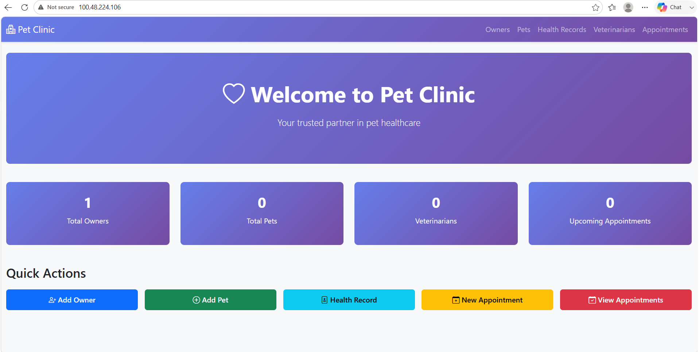
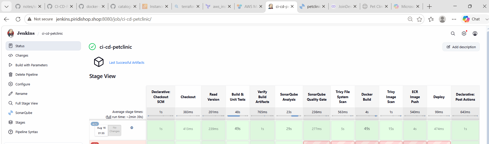
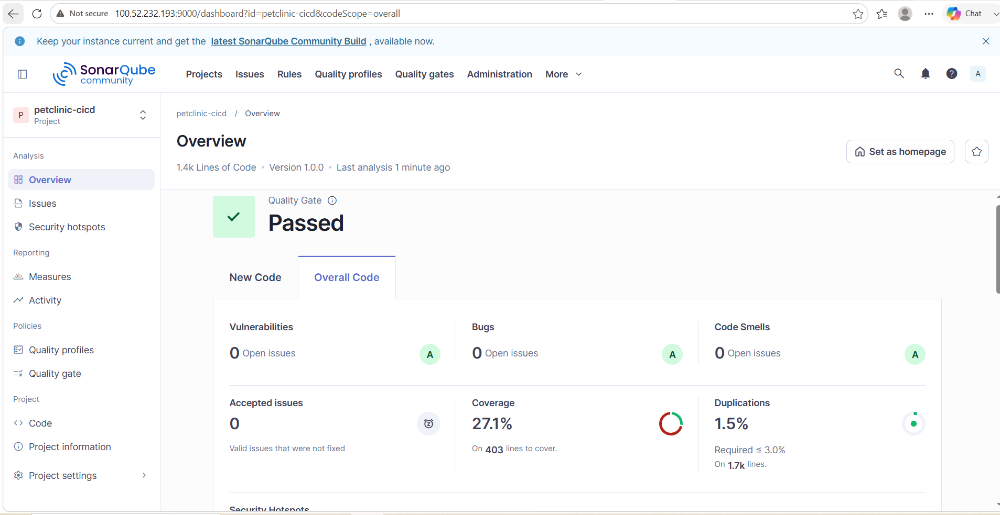
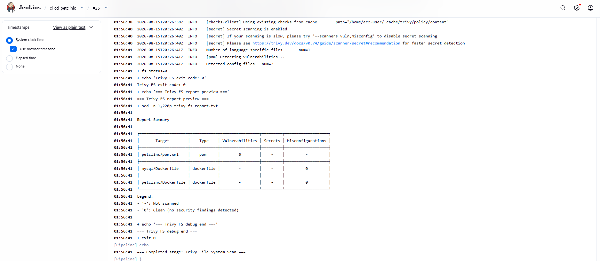
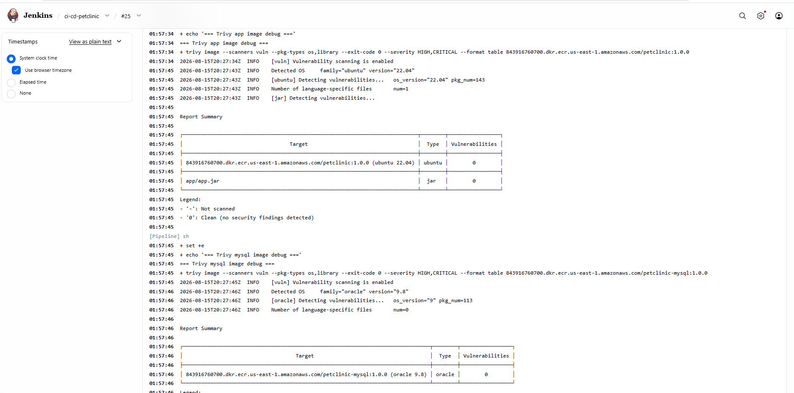

# Pet Clinic Management System

A Spring Boot-based pet clinic application for managing owners, pets, veterinarians, appointments, and health records. This project includes a CI/CD pipeline with Maven build verification, SonarQube quality checks, Trivy security scans, Docker image builds, and ECR publishing.

## Features

- Owner management with add, edit, view, search, and delete flows
- Pet registration and owner mapping
- Health record tracking for pets
- Veterinarian profile management
- Appointment scheduling and dashboard overview
- Thymeleaf + Bootstrap-based responsive UI
- Input validation on forms
- MySQL persistence with Spring Data JPA
- Jenkins CI/CD pipeline with SonarQube + Trivy integrations
- JaCoCo coverage enforcement for 80% line coverage

## Tech Stack

- Java 17
- Spring Boot 3.5.14
- Thymeleaf
- Spring Data JPA
- MySQL 8
- Maven
- Jenkins
- SonarQube
- Trivy
- Docker / Amazon ECR
- JUnit 5 + Mockito
- JaCoCo

## Repository Structure

```text
CI-CD-Pet-Clinc-app-Jenkins/
├── Jenkinsfile
├── README.md
├── sonar-issues.json
├── sonar-project.properties
├── docker-compose.yaml
├── mysql/
│   └── Dockerfile
├── petclinc/
│   ├── Dockerfile
│   ├── pom.xml
│   ├── src/
│   │   ├── main/
│   │   └── test/
│   └── target/   (generated after build)
└── .env.example
```

## Prerequisites

- Java 17+
- Maven 3.8+
- Docker
- MySQL or Docker Compose
- Jenkins with required plugins:
  - Pipeline
  - AnsiColor
  - AWS Credentials
  - SonarQube Scanner
- SonarQube server configured as `sonar-server`
- Trivy installed on the Jenkins agent

## Local Setup

### 1. Clone repository

```bash
git clone https://github.com/venkatdevops2009/CI-CD-Pet-Clinc-app-Jenkins.git
cd CI-CD-Pet-Clinc-app-Jenkins
```

### 2. Build the app

```bash
cd petclinc
mvn clean verify
```

### 3. Run the app locally

```bash
cd petclinc
mvn spring-boot:run
```

Application URL:

```text
http://localhost:8080
```

### 4. Run with Docker Compose

```bash
docker-compose up --build
```

## CI/CD Pipeline

The project includes a Jenkins pipeline in `Jenkinsfile` that performs:

1. Checkout source code
2. Read project version from `pom.xml`
3. Maven clean verify build
4. Artifact verification
5. SonarQube static analysis
6. Quality gate check
7. Trivy filesystem scan
8. Docker image build for app and MySQL
9. Trivy image scan
10. Push images to ECR
11. Optional deployment step controlled by the `DEPLOY` parameter

### Jenkins configuration

The Jenkins pipeline expects:

- SonarQube server named: `sonar-server`
- AWS credentials ID: `aws-creds`
- Node/agent label: `roboshop`
- AnsiColor plugin installed for colorized console logs

### Sonar and coverage requirements

- SonarQube analysis runs on `src/main/java` and `src/test/java`
- JaCoCo report path is configured in `pom.xml`
- The project enforces 80% line coverage in the `jacoco:check` lifecycle step

## Quality and Security Checks

### SonarQube

The project is configured for Sonar scanning via Maven and Jenkins.

```bash
cd petclinc
mvn sonar:sonar
```

### Trivy

```bash
trivy fs --scanners vuln,secret,misconfig --severity HIGH,CRITICAL .
```

## Screenshots

### Pet Clinic Application UI



### Jenkins Build Pipeline



### SonarQube Code Quality Check



### Trivy Filesystem Scan



### Trivy Image Scan



## Notes

- `sonar-issues.json` is a snapshot of static analysis issues from the Sonar scan and was used to guide remediation.
- The project includes the 80% code coverage gate in the Maven build to satisfy quality expectations.
- Jenkins runtime output is colorized via the AnsiColor plugin.

## License

This project is provided as-is for educational and demo use.
